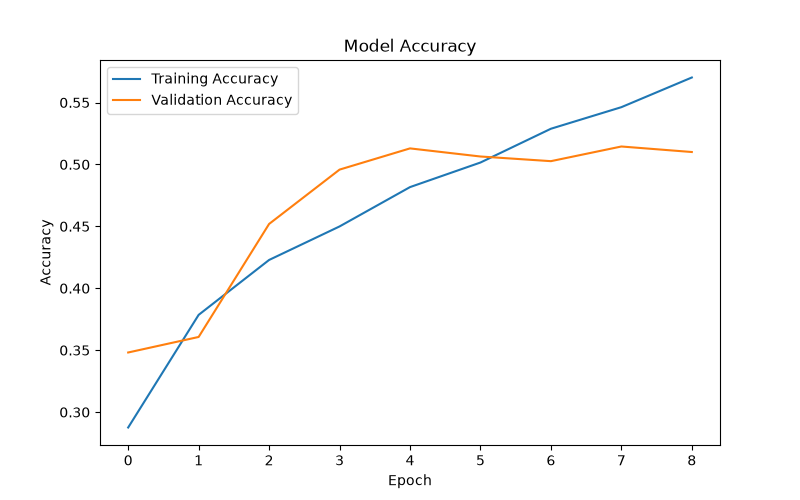
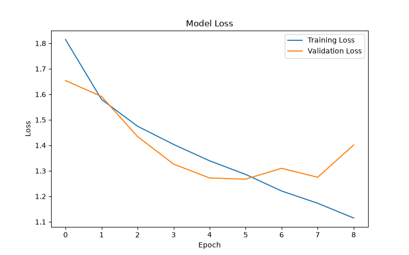

# 😊 Facial Emotion Recognition

A real-time facial emotion recognition system built using **TensorFlow**, **OpenCV**, and **Python**. The project uses a Convolutional Neural Network (CNN) trained on the FER-2013 dataset to classify facial expressions into seven emotions.

---

## 📌 Features

- 🎥 Real-time emotion detection using webcam
- 🖼️ Predict emotion from a single image
- 🧠 CNN model built from scratch
- 📊 Training and validation accuracy graphs
- 📈 Model evaluation on test dataset
- 😊 Detects 7 facial emotions:
  - Angry
  - Disgust
  - Fear
  - Happy
  - Neutral
  - Sad
  - Surprise

---

## 🛠️ Tech Stack

- Python 3.11
- TensorFlow / Keras
- OpenCV
- NumPy
- Matplotlib
- Scikit-learn

---

## 📂 Project Structure

```text
Face-Expression-Detector/
│
├── dataset/
│   ├── train/
│   └── test/
│
├── models/
│   └── emotion_model.keras
│
├── results/
│   ├── accuracy.png
│   └── loss.png
│
├── src/
│   ├── train.py
│   ├── model.py
│   ├── dataset_loader.py
│   ├── preprocess.py
│   ├── predict.py
│   ├── webcam.py
│   ├── evaluate.py
│   ├── plot_history.py
│   └── utils.py
│
├── README.md
├── requirements.txt
└── .gitignore
```

---

## 🚀 Installation

Clone the repository

```bash
git clone <https://github.com/tauseefkhan007/Facial-Emotion-Recognition>
```

Move into the project

```bash
cd Face-Expression-Detector
```

Create a virtual environment

```bash
python -m venv venv
```

Activate it

### macOS/Linux

```bash
source venv/bin/activate
```

### Windows

```bash
venv\Scripts\activate
```

Install dependencies

```bash
pip install -r requirements.txt
```

---

## ▶️ Training

```bash
python src/train.py
```

---

## 🎥 Webcam Detection

```bash
python src/webcam.py
```

Press **Q** to quit the webcam.

---

## 🖼️ Predict a Single Image

```bash
python src/predict.py
```

---

## 📊 Model Performance

**Test Accuracy:** **50.64%**

**Test Loss:** **1.267**

---

## 📈 Training Graphs

### Accuracy



### Loss



---

## 🔮 Future Improvements

- Data augmentation
- Transfer learning (MobileNetV2 / EfficientNet)
- Better CNN architecture
- Web application using Flask or FastAPI
- Deploy on Hugging Face Spaces or Render
- Mobile application integration

---

## 📚 Dataset

FER-2013 Facial Expression Recognition Dataset

---

## 👨‍💻 Author

**Tauseef Khan**

---

## 🖥️ Development Environment

- **Device:** Apple MacBook Air
- **Operating System:** macOS
- **Python:** 3.11
- **IDE:** Visual Studio Code

---

## ⭐ If you found this project useful

Please consider giving it a ⭐ on GitHub.